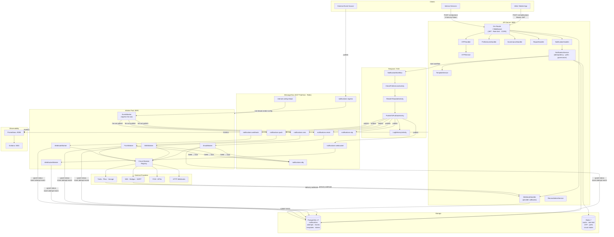
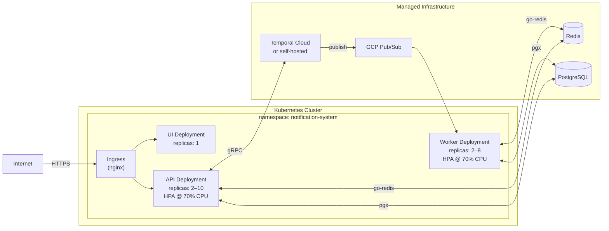

# System Architecture

## Overview

The notification service is a multi-channel, event-driven delivery platform built around three runtimes — an **HTTP API**, a **pool of channel workers**, and **Temporal** for durable workflow orchestration — backed by PostgreSQL and Redis, with GCP Pub/Sub or Redis Pub/Sub as the message bus.

---

## Component Diagram

---

## Layer Responsibilities

| Layer | Technology | Responsibility |
|---|---|---|
| **API** | Gin · JWT · pgx | Accept requests, idempotency, governance checks, template rendering, workflow start |
| **Workflow Engine** | Temporal 1.24 | Durable orchestration, retry policies (5 attempts, 2× backoff), scheduled delivery |
| **Message Bus** | GCP Pub/Sub · Redis Pub/Sub | Decouple API from workers; per-channel topics; DLQ for exhausted retries |
| **Workers** | Go goroutines | Subscribe per-channel, dispatch via provider with circuit-breaker fallback, record attempts |
| **Circuit Breaker** | Sony Gobreaker | Per-vendor open/half-open/closed state; fast-fail + automatic recovery |
| **Providers** | SES, Mailgun, SMTP / Twilio, Plivo, Vonage / FCM / HTTP | Actual delivery to end-user |
| **PostgreSQL** | pgx · golang-migrate | Source of truth: notifications, attempts, events, templates, governance |
| **Redis** | go-redis v9 | Rate-limit sliding windows, OTP TTLs, preference cache, circuit-breaker state |
| **Observability** | Prometheus · Grafana | Per-channel delivery rate, latency percentiles, error rates, circuit-breaker flips |

---

## Deployment Topology

