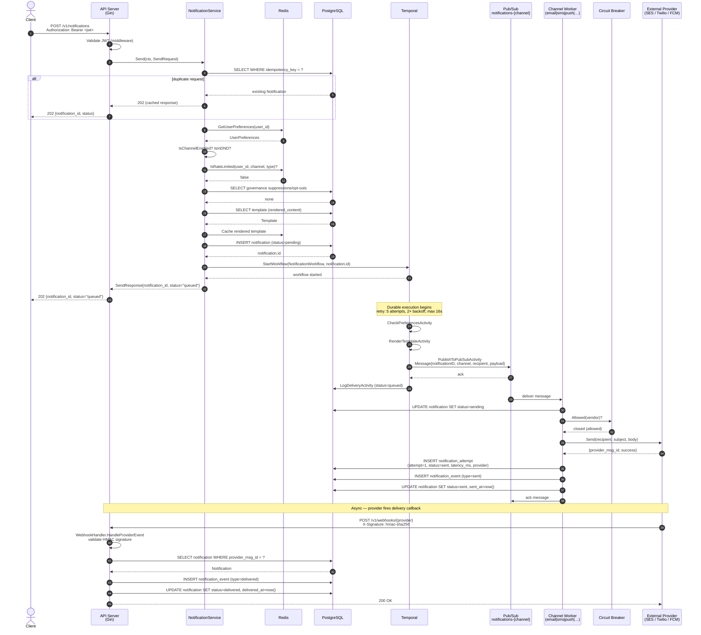
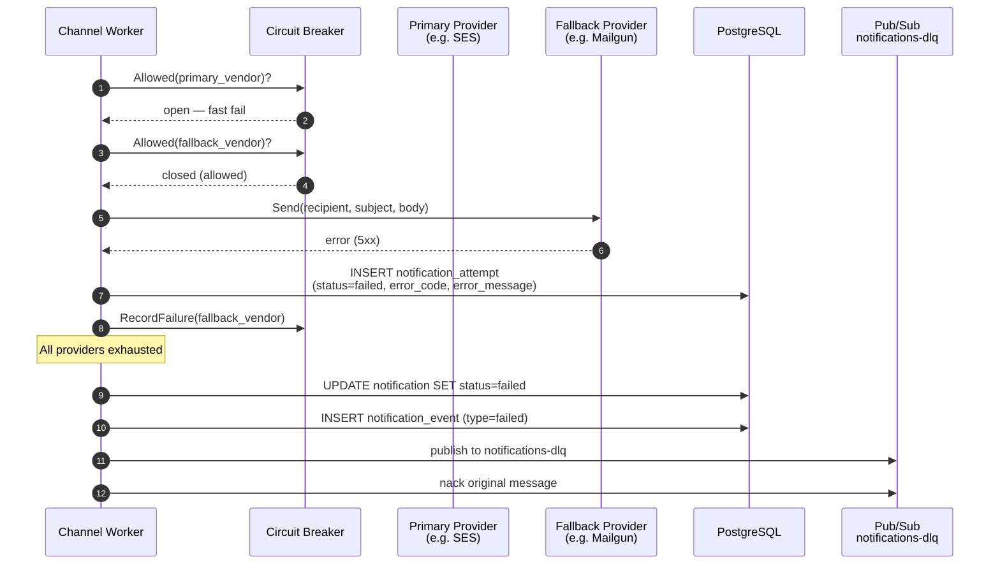
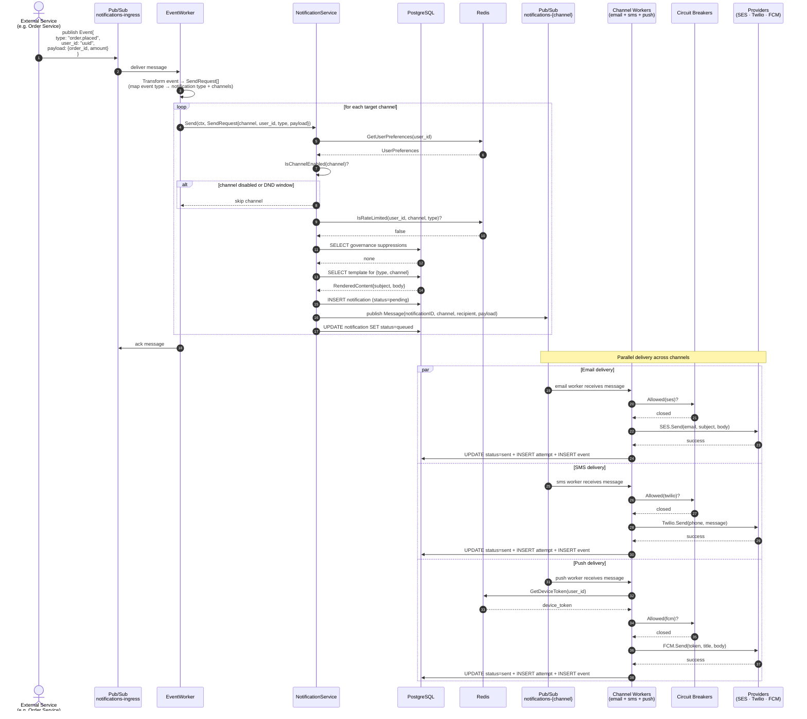
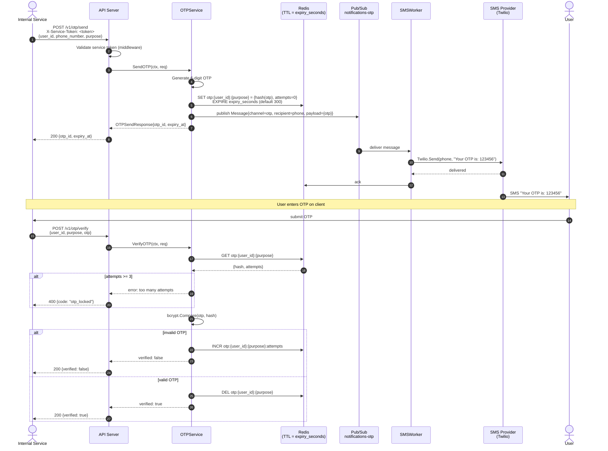
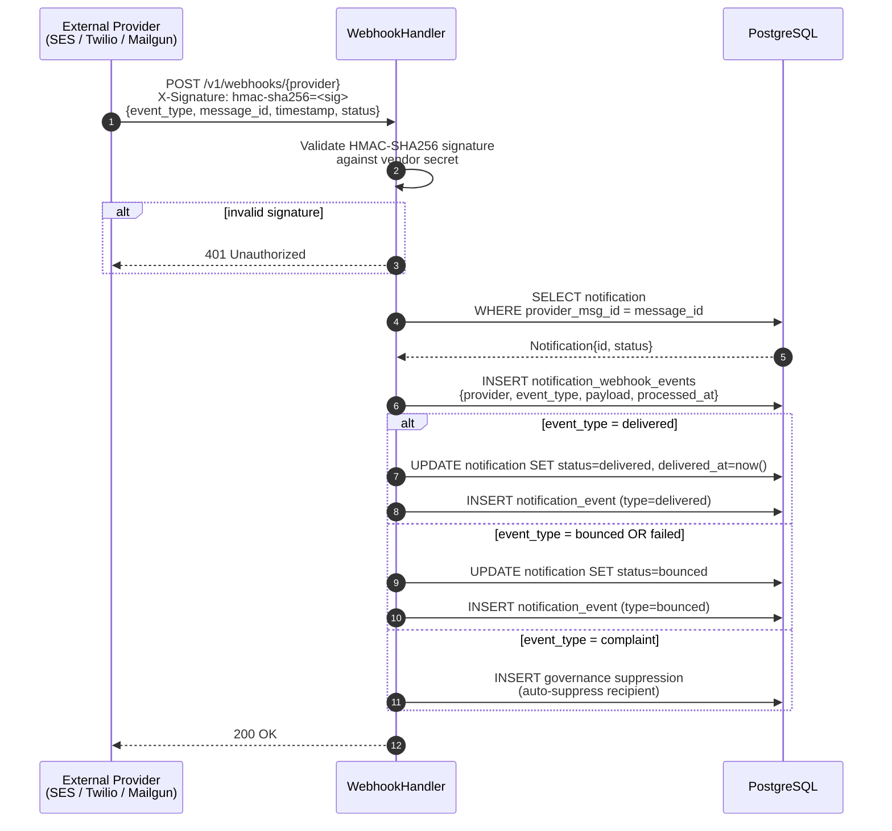

# Sequence Diagrams

Two primary flows are documented here:

1. **API Flow** — a caller POSTs a notification through the HTTP API
2. **Pub/Sub Event-Driven Flow** — an external service publishes an ingress event that fans out into channel deliveries

---

## 1. API Flow — Send Notification

Covers the full lifecycle from HTTP request to final delivery confirmation, including the Temporal workflow, channel worker dispatch, and provider webhook callback.

### Failure & Retry Path

---

## 2. Pub/Sub Event-Driven Flow — Ingress Event Fan-Out

Covers the path where an external service (e.g. an order service, auth service) publishes a domain event to the ingress topic, which the EventWorker transforms and fans out into per-channel deliveries.

---

## 3. OTP Flow

Short-lived, service-to-service path used for phone verification.

---

## 4. Webhook Provider Callback Flow

Handles asynchronous delivery confirmations (bounces, delivery receipts) pushed by email/SMS providers.

